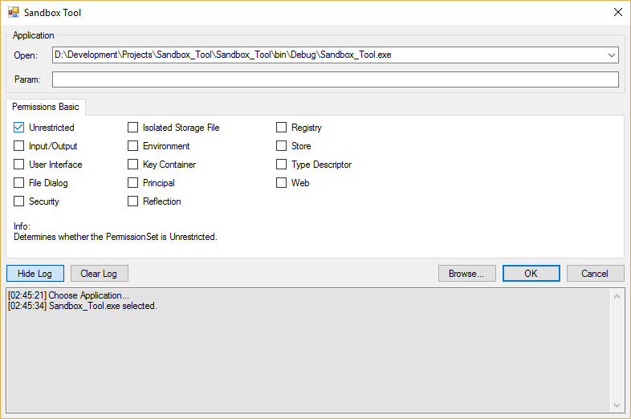

***
## sandbox-tool
The aim of this project is to build a tool that is useful in exploring the concepts of trustworthy computing. With reference to the Microsoft online documentation, which has an example illustrating how to program a tool in the article ['How To: Run a Partially Trusted Code in a Sandbox'](https://docs.microsoft.com/en-us/dotnet/framework/misc/how-to-run-partially-trusted-code-in-a-sandbox).

This tool might be useful in running student course work submissions during assessment. The user interface should allow the user to select a program and choose the relevant permissions.

A windowed interface will be useful for interactive use of the tool for less experienced users, but will include support for command-line.

## Screenshots
